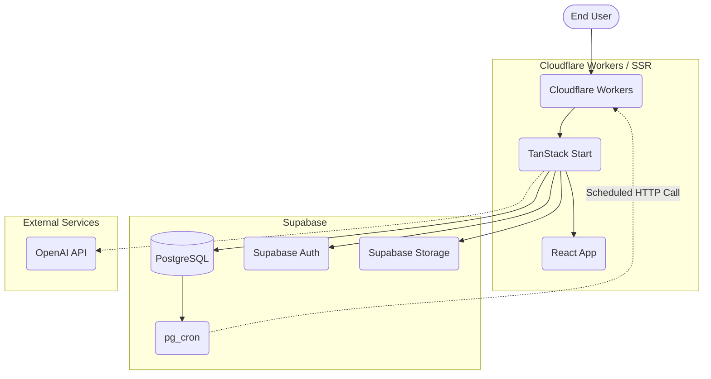

# NDOS Architecture

## Overview

The NEOMARC Digital Operating System (NDOS) is structured to run independently using modern full-stack web technologies.

## Core Components
- **Hosting & SSR**: Cloudflare Workers
- **Framework**: React via TanStack Start
- **Database & Backend**: Supabase (PostgreSQL, Auth, Storage)
- **Background Jobs**: pg_cron in Supabase scheduling calls to the Automation Runner on Cloudflare.
- **AI Processing**: Server-side functions integrating directly with OpenAI API for receipt and expense analysis.
